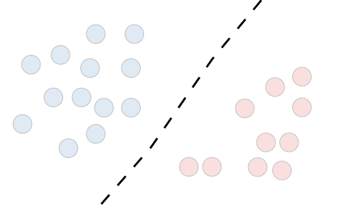
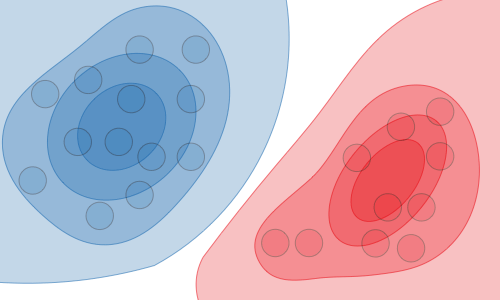

# 第一章 绪论

> 后面插点从深度学习角度拿到的点
>
> - 关于机器学习三要素, 复旦大学邱锡鹏教授也有解读[^2]: 模型, 学习准则, 优化算法. 这个定义比较接近代码. 以Tensorflow为例. 通常会定义一个网络(模型), 定义Loss(学习准则), 定义优化算法(Optimizer), 然后开Session, 不停的把数据带入用Opitmizer去最小化Loss.
> - Losses, Metrics, 在Keras里面划分了两个模块, 解释是Losses是BP过程用到的, 而Metrics实际和损失函数类似, 用来评价模型的性能, 但是不参与反向传播. 从源码也能看到, Metrics里面import了很多Loss算法

## 统计学习

总目标：考虑学习什么样的模型和如何学习模型，使得模型能对数据进行准确的预测与分析，同时尽可能提高学习效率。

| 统计学习的步骤                                        |
| ----------------------------------------------------- |
| 1. 得到一个有限的训练数据集合                         |
| 2. 确定包含所有可能的模型的假设空间，即学习模型的集合 |
| 3. 确定模型选择的准则，即学习的策略                   |
| 4. 确定模型选择的准则，即学习的策略                   |
| 5. 通过学习方法选择最优的模型                         |
| 6. 利用学习的最优模型对新数据进行预测或分析           |

### 分类

**基本分类**

> 监督学习，样本表示(x, y)对，在无监督学习里面，样本就是x。

- 监督学习
- 无监督学习
- 强化学习

**按模型分类**

- 概率模型
- 非概率模型

> 在监督学习中，概率模型是生成模型，非概率模型是判别模型。

**按算法分类**

- 在线学习
- 批量学习

>在线学习通常比批量学习更难。

**按技巧分类**

- 贝叶斯学习
- 核方法

### 基本概念

1. 输入空间、特征空间、输出空间
2. 联合概率分布：监督学习假设输入输出X和Y遵循联合概率分布P(X,Y)，这是基本假设。
3. 假设空间

##统计学习方法三要素

###1. 模型

|              | 假设空间$\cal F$                                             | 输入空间$\cal X$ | 输出空间$\cal Y$ | 参数空间      |
| ------------ | ------------------------------------------------------------ | ---------------- | ---------------- | ------------- |
| 决策函数     | $\cal F\it =\{f_{\theta} |Y=f_{\theta}(x), \theta \in \bf R \it ^n\}$ | 变量             | 变量             | $\bf R\it ^n$ |
| 条件概率分布 | $\cal F\it =\{P|P_{\theta}(Y|X),\theta\in \bf R \it ^n\}$    | 随机变量         | 随机变量         | $\bf R\it ^n$ |

###2. 策略（Loss）

**损失函数（loss function）**

> Loss function – A loss function is a function L : (z,y) ∈ R × Y −7→ L(z,y) ∈ R that takes as inputs the **predicted value z** corresponding to the **real data value y** and outputs **how different they are.** The common loss functions are summed up in the table below:

| Loss Function |                   公式                   |                             图例                             |        应用         |
| :-----------: | :--------------------------------------: | :----------------------------------------------------------: | :-----------------: |
| Least squared | $L(Y,f(X)) = \tfrac{1}{2} (Y - f(X))^2$  |  |  Linear regression  |
|   Logistic    |         $log(1 + exp(−Y*f(X)))$          |  | Logistic regression |
|     Hinge     |           $max(0,1 − Y*f(X))$            |  |         SVM         |
| Cross-entropy | $− Y*log(f(X)) + (1 − Y)* log(1 − f(X))$ |  |   Neural Network    |

 

**风险函数(risk function)/期望损失(expected loss)**
这个和模型的泛化误差的形式是一样的
$$
R_{exp}(f)=E_p[L(Y, f(X))]=\int_{\mathcal X\times\mathcal Y}L(y,f(x))P(x,y)\, {\rm d}x{\rm d}y
$$
模型$f(X)$关于联合分布$P(X,Y)$的**平均意义下的**损失(**期望**损失)，但是因为$P(X,Y)$是未知的，所以前面的用词是**期望**，以及**平均意义下的**。

这个表示其实就是损失的均值，反映了对整个数据的预测效果的好坏，$P(x,y)$转换成$\frac {\nu(X=x, Y=y)}{N}$更容易直观理解, 可以参考[CH09](../CH09/README.md)，6.2.2节的部分描述来理解，但是真实的数据N是无穷的

**代价函数（cost function）**

> The cost function $J$  is commonly used to assess the performance of **a model**, and is defined with the loss function $L$  as follows:

$$
{J(\theta)=\sum_{i=1}^mL(h_\theta(x^{(i)}), y^{(i)})}
$$

###3. 算法（优化算法）

###4. 

##生成模型与判别模型

|                | Discriminative model                     | Generative model                                 |
| -------------- | ---------------------------------------- | ------------------------------------------------ |
| Goal           | Directly estimate P(y\|x)                | Estimate P(x\|y) to deduce P(y\|x)               |
| What’s learned | Decision boundary                        | Probability distributions of the data            |
| Illustration   |  |  |
| Examples       | Regressions, SVMs                        | GDA, Naive Bayes                                 |